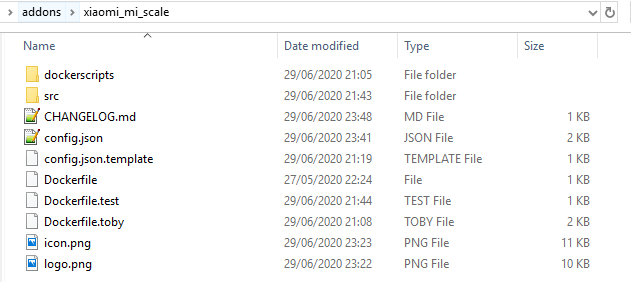

# Xiaomi Mi Scale Add On for Home Assistant

Add-On for [HomeAssistant](https://www.home-assistant.io/) to read weight measurements from Xiaomi Body Scales.

## Supported Scales:
Name | Model | Picture
--- | --- | :---:
[Mi Smart Scale 2](https://www.mi.com/global/scale) &nbsp; &nbsp; &nbsp; &nbsp; &nbsp; &nbsp; &nbsp; &nbsp; &nbsp; &nbsp; &nbsp; &nbsp; &nbsp; &nbsp; &nbsp; &nbsp; &nbsp; &nbsp; &nbsp; &nbsp; &nbsp; &nbsp; &nbsp; &nbsp; &nbsp; &nbsp; &nbsp; &nbsp; &nbsp; &nbsp; &nbsp; &nbsp; &nbsp; &nbsp; &nbsp; &nbsp; &nbsp; &nbsp; &nbsp; &nbsp; &nbsp; &nbsp; &nbsp; &nbsp; &nbsp; &nbsp; &nbsp; | XMTZC04HM | 
[Mi Body Composition Scale](https://www.mi.com/global/mi-body-composition-scale/) | XMTZC02HM | 
[Mi Body Composition Scale 2](https://c.mi.com/thread-2289389-1-0.html) | XMTZC05HM | 


## Setup & Configuration

1. Retrieve the scale's MAC Address based on the Xiaomi Mi Fit app.

2. Clone this repository
`git clone https://github.com/lolouk44/xiaomi_mi_scale_ha_add_on`

3. Create a new directory xiaomi_mi_scale in the folder addons in your Home Assistant installation and place all files in it via SSH



4. Adjust the Dockerfile according to your needs
```
# adjust here the environment variables
ENV HCI_DEV hci0
ENV MISCALE_MAC 00:00:00:00:00:00
ENV MQTT_PREFIX miScale
ENV MQTT_HOST 192.168.0.1
ENV MQTT_USERNAME username
ENV MQTT_PASSWORD password
ENV MQTT_PORT 1883
ENV TIME_INTERVAL 30

ENV USER1_GT 70
ENV USER1_SEX male
ENV USER1_NAME Jo
ENV USER1_HEIGHT 175
ENV USER1_DOB 1990-01-01

ENV USER2_LT 35
ENV USER2_SEX female
ENV USER2_NAME Serena
ENV USER2_HEIGHT 95
ENV USER2_DOB 1990-01-01

ENV USER3_SEX female
ENV USER3_NAME Missy
ENV USER3_HEIGHT 150
ENV USER3_DOB 1990-01-01
```

5. Open Home Assistant and navigate to add-on store and clock the reload button on the top right corner. Now you should see the Xiaomi Mi Scale as a local add-on


6. Install the add-on (takes a while as the container is built locally)

7. Start the add-on


## Home-Assistant Setup:
Under the `sensor` block, enter as many blocks as users configured in your environment variables:

```yaml
  - platform: mqtt
    name: "Example Name Weight"
    state_topic: "miScale/USER_NAME/weight"
    value_template: "{{ value_json['Weight'] }}"
    unit_of_measurement: "kg"
    json_attributes_topic: "miScale/USER_NAME/weight"
    icon: mdi:scale-bathroom

  - platform: mqtt
    name: "Example Name BMI"
    state_topic: "miScale/USER_NAME/weight"
    value_template: "{{ value_json['BMI'] }}"
    icon: mdi:human-pregnant

```


## Acknowledgements:
Thanks to @syssi (https://gist.github.com/syssi/4108a54877406dc231d95514e538bde9) and @prototux (https://github.com/wiecosystem/Bluetooth) for their initial code

Special thanks to [@ned-kelly](https://github.com/ned-kelly) for his help turning a "simple" python script into a fully fledged docker container

Thanks to [@bpaulin](https://github.com/bpaulin) for his PRs and collaboration, and to [@Tobi0892](https://github.com/Tobi0892) for his hass.io screenshots
